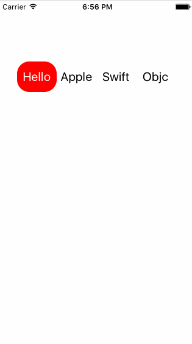
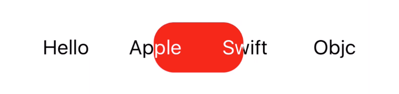
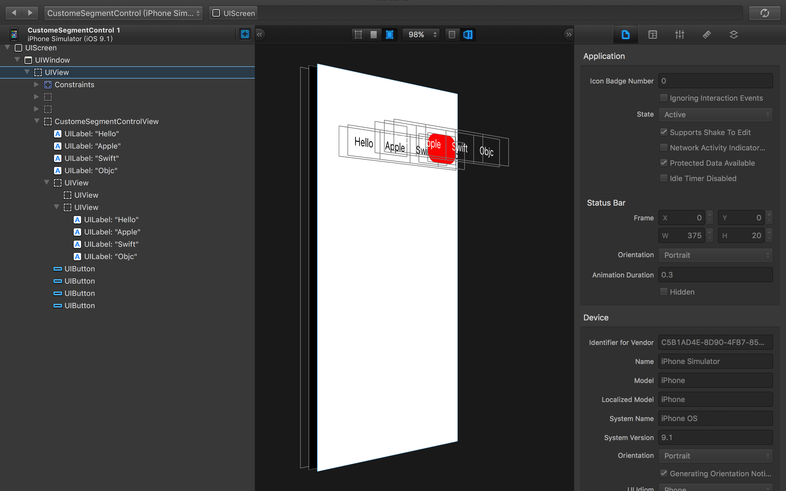

# ZLCustomeSegmentControlView
# 视错觉Demo
# 一、一个利用视错觉的自定义组件
当第一次看到这个组件效果时，感觉没有什么特别之处，就是一个普通在普通不过的组件。可是再仔细看就感觉不一样了，一些细节处理的非常好。看到组件效果时，因为没有源码，所以当时也不知道如何实现的。就想呗，然后就想到了用“视错觉”这个高大上的东西来实现。当然这个实现方案是我自己想出来的，我不知道原作者是如何实现的，下面给出了我自己的实现方案。 说这么多，先来看一下运行效果吧。
#### 1. 该组件的运行效果如下，其实就是一个自定义的SegmentControl。看到该组件的时候，我的第一印象是：“这个组件应该挺好做的”。当时感觉就是几个Button, 然后红色的是一个UIView,点击那个Button时，就把UIView通过动画的形式移动到当前点击的Button。顶多就是封装一下，成为一个自定义组件，然后给别人使用。
      


#### 2.效果分析
在仔细看效果，感觉自己还是太年轻，太单纯了。这个组件远远不是我想的那样，上面组件的实现的重点与难点不在于如何去运动，如何去封装它。而在于下面这个截图中的东西。如果把动画放慢，你会发现一个细节，这个细节处理的非常的巧妙，也是这个组件的亮点与难点所在。下方是切换时放慢的一个效果。看到这个细节时，瞬间颠覆了我之前单纯的想法。这个组件远远没有我想的这么简单。

在切换时，有一个细节，就是在红色区域中的文字（或文字的一部分）随着红色区域的移动，文字的颜色也会随之部分改变。当红色区域移动过后，字体颜色又变为原来的了。看到这个效果，对这个组件的崇拜感就油然而生了。瞬间也蒙圈了，一时没有解决思路。大脑中充满了无数的问号。这究竟用了什么黑科技！？实现了这么NX的效果。晚上做地铁回家的时候也一直在想其解决方案。果然在地铁上灵光一现，应该就是用它：“视错觉”。于是乎就回家晚饭都没吃，就拿出笔记本开始按着自己的思路去实现。功夫不负有心人呢，所以才有了今天的博客。当然实现上述效果是我自己的思路，如果还有其他更好的实现方式欢迎交流。
　　　

　　　
# 二.实现原理
#### 1.原理介绍
实现上述效果时，如果按着我看到的就是看到的来实现的话，估计会无从下手的。一个原则：“眼见为虚”，就OK了。今天这篇博客，我不想往上粘贴过多的代码，还是把我的思路给大家分享一下就好。其实编程这东西，有时候思路比代码更为重要。下方我想用在Reveal工具上的分析层次来给大家聊一下实现原理。
通过Reveal上面的UI层次我们很容易看出，这个组件远比我们想象的要复杂的多。我的实现方式如下：
* (1) 先在View上加上一层的Label, 这些Label用来显示常规的字体颜色（未选中时的颜色）（黑色的字）
* (2) 在之前的Label上添加一层View , 动画元素，高亮显示的字体，点击的按钮都在这个View上
* (3) 在这个View上添加一层高亮的Label（白色的字）, Label的字体，大小，位置等要和底层的Label一致（除了颜色除外）
* (4) 上层的View的大小要和一个Label的大小一致，并且设置超出View的子视图不显示。
* (5) 移动View（红色部分）时，也要移动View上白色的字。要保持移动的过程中，白色Label和黑色label完全重合。

这样View移动到那个label上时，就会把后边的黑色Label给挡上，显示的是上面白色的Label.原理大概就是这个原理，原理一旦知道怎么回事了，至于实现起来就简单许多了。　
　　　


#### 2.该自定组件可配置项如下
```Objective-C
//
//  ZLCustomeSegmentControlView.h
//  CustomeSegmentControl
//
//  Created by ZeluLi on 15/11/19.
//  Copyright © 2015年 zeluli. All rights reserved.
//

#import <UIKit/UIKit.h>

typedef void(^ButtonOnClickBlock)(NSInteger tag, NSString * title);

@interface ZLCustomeSegmentControlView : UIView

@property (nonatomic, strong) NSArray *titles;                      //标题数组
@property (nonatomic, strong) UIColor *titlesCustomeColor;          //标题的常规颜色
@property (nonatomic, strong) UIColor *titlesHeightLightColor;      //标题高亮颜色
@property (nonatomic, strong) UIColor *backgroundHeightLightColor;  //高亮时的颜色
@property (nonatomic, strong) UIFont *titlesFont;                   //标题的字号
@property (nonatomic, assign) CGFloat duration;                     //运动时间

/**
*  点击按钮的回调
*
*  @param block 点击按钮的Block
*/
-(void) setButtonOnClickBlock: (ButtonOnClickBlock) block;

@end
```

#### 3.该自定义组件的调用方式
```Objective-C
ZLCustomeSegmentControlView *v = [[ZLCustomeSegmentControlView alloc] initWithFrame:CGRectMake(30, 100, SCREEN_WIDTH - 60, 50)];

v.titles = @[@"Hello", @"Apple", @"Swift", @"Objc"];
v.duration = 0.7f;

[v setButtonOnClickBlock:^(NSInteger tag, NSString *title) {
    NSLog(@"index = %ld, title = %@", (long)tag, title);
}];

[self.view addSubview:v];
```
